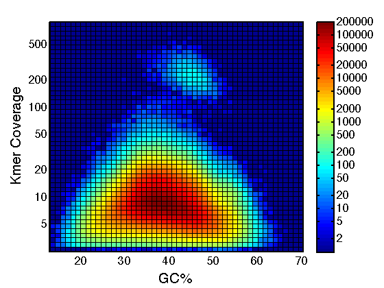
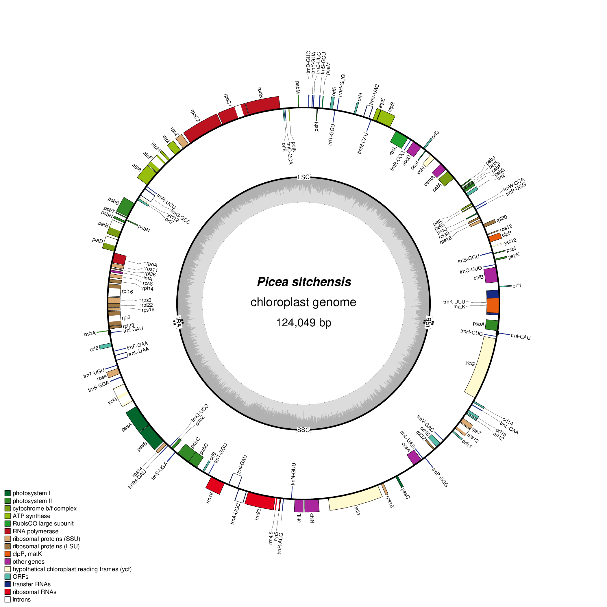

# Synopsis

+ Whole genome sequencing data contains reads from both the nuclear and organellar genomes
+ Reads of the organellar genomes are abundant, because each cell contains hundreds of mitochondria and plastids
+ One lane of HiSeq 10x Gemcode data assembles the 124 kbp plastid genome
+ One lane of HiSeq 10x Chromium data assembles the estimated 6 Mbp mitochondrion
+ The assembly is composed of organellar sequence as well as nuclear repeat elements
+ The organellar sequences are separated from the assembly by classifying the sequences using their length, depth of coverage, GC content and homology to known sequences
+ We assembled the complete annotated sequence of the Sitka spruce plastid genome (Coombe et al. 2016) and assembled and annotated a draft genome of the mitochondrion

# Genome Skimming

# Scaffolding with ARCS

# Plastid

# Mitochondrion

# Assembly and Annotation Metrics

| Read Metrics                    | Plastid         | Mitochondrion
|---------------------------------|-----------------|--------------
| Number of HiSeq lanes           | 1 GemCode lane  | 1 Chromium lane
| Read length                     | 2 x 125 bp      | 2 x 150 bp
| Number of read                  | 630 million     | 843 million
| Number selected for assembly    | 4.3 million     | 119 million
| Number mapped to assembly       | 15,232 of 4.3 M | 3.78 M of 843 M
| Proportion of organellar reads  | 1/283 0.35%     | 1/223 or 0.45%
| Depth of coverage               | 17x             | 40x

| Assembly Metrics                | Plastid         | Mitochondrion
|---------------------------------|-----------------|--------------
| Assembled genome size           | 124,029 bp      | 6.09 Mbp
| Number of contigs               | 1 contig        | 1,216 contigs
| Contig N50                      | 124 kbp         | 13.7 kbp
| Number of scaffolds             | 1 scaffold      | 239 scaffolds
| Scaffold N50                    | 124 kbp         | 461 kbp
| Largest scaffold                | 124 kbp         | 1,223 kbp
| GC content                      | 38.8%           | 43.6%

| Annotation Metrics              | Plastid         | Mitochondrion
|---------------------------------|-----------------|--------------
| Number of genes w/o ORFS        | 114 (108)       | 115 (67)
| Protein-coding genes (mRNA)     | 74 (72)         | 84 (47)
| rRNA genes                      | 4 (4)           | 3 (2)
| tRNA genes                      | 36 (32)         | 25 (18)
| ORFs ≥ 300 bp                   | 4               | 1,154
| Introns in coding genes         | 9 (8)           | 9 (6)
| Introns in tRNA genes           | 6 (6)           | 0

Note: The number of distinct genes is shown in parentheses.
